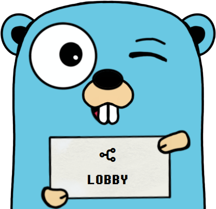

<p align="center">
    <picture>
      
    </picture>
</p>

**Lobby** is a simple, yet highly performant, load balancer based on Linux [nftables](https://wiki.nftables.org/wiki-nftables/) designed to run as a portable binary app on Linux systems in amd64 and arm64 architectures.

# Quick Start
Use the helper script which downloads the latest Lobby binary to your current folder and sets a sample config file.

``` bash
wget -O - https://ipbuff.com/getLobby | sh
```

Once the script completes, it will inform you about the required permissions and the need for IP forwarding to be enabled. 

For testing purposes it might be easier to run Lobby with the `root` user. Run Lobby with:

``` bash
./lobby
```

To check on how to run it as unprivileged user check [here](https://lobby.ipbuff.com/installation/#permissions).

To edit the Lobby settings, edit the `lobby.conf` file. Configuration documentation may be found [here](https://lobby.ipbuff.com/configuration).

A relatively extensive tutorial can also be found in the Lobby documentation. Make sure to check it for many practical examples.

# Documentation
The Lobby documentation is published at [https://lobby.ipbuff.com](https://lobby.ipbuff.com).

The documentation source is in the [./docs/src](https://github.com/ipbuff/lobby/tree/main/docs/src) directory of this repository.

# Credits
This project has been created by [Igor Borisoglebski](https://igor.borisoglebski.com).

[Gopher Konstructor](https://quasilyte.dev/gopherkon/), created by [quasilyte](https://github.com/quasilyte/gopherkon) was used for the logo creation.

# License
This work is licensed under [CC BY-NC-SA 4.0](http://creativecommons.org/licenses/by-nc-sa/4.0/).

Creative Commons Attribution-NonCommercial-ShareAlike 4.0 International License
