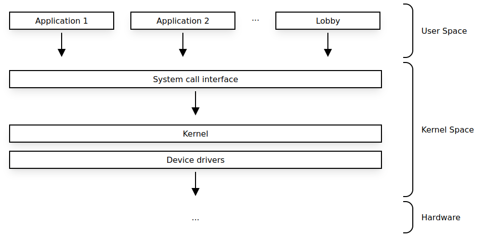
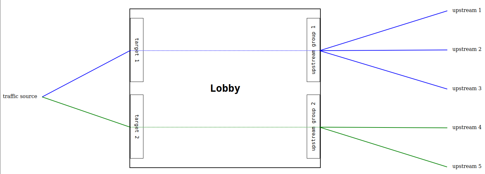

Lobby leverages the Linux kernels networking stack for network traffic processing and therefore the load balancing is not performed at the application layer, but at the kernel level.

To set up the kernel networking stack, Lobby uses the [netfilter](https://wikipedia.org/wiki/Netfilter) framework through the [nftables](https://wikipedia.org/wiki/Nftables) Linux kernel subsystem.

<figure markdown>
{ loading=lazy }
<figcaption>Network packet processing with Lobby</figcaption>
</figure>

All of the configuration interpretation, upstream health checking, DNS resolution and respective traffic routing orchestration are peformed by Lobby. This approach is perfectly sufficient to implement comprehensive and efficient load balancing capabilities. 

## Concepts and Definitions

These are some of the key concepts and definitions in Lobby's context.

<figure markdown>
{ loading=lazy }
<figcaption>Lobby conceptual representation</figcaption>
</figure>

### Targets
A target is where the traffic is being expected at the Lobby host. Currently a target is only defined by the network protocol, such as TCP, and a network port. Each target must be unique.

Targets use [upstream groups](#upstream-groups) to load balance traffic.

| Definition | Description |
| - | - |
| **name** | unique name representing the target |
| **protocol** | the network protocol [`tcp`] |
| **port** | unique port for the specified protocol |
| **upstream_group** | the [upstream group](#upstream-groups) object linked to the target |

### Upstream Groups
An upstream group is a collection of one or more [upstreams](#upstreams) associated to one [target](#targets). The definition of the distribution mode of the traffic across upstreams is done by an upstream group.

| Definition | Description |
| - | - |
| **name** | unique name representing the upstream group |
| **distribution** | traffic distribution mode [[`round-robin`](#round-robin)] |
| **upstreams** | list of [upstream](#upstreams) objects linked to the upstream group |

#### Distribution Modes
##### round-robin
All outgoing traffic is spread evenly across all of the available upstreams.

### Upstreams
An upstream is a destination to which the traffic will be proxied to. Upstreams are defined by a network address (`host`) and a network port (`port`).

| Definition | Description |
| - | - |
| **name** | unique name representing the upstream |
| **host** | upstream network address as IPv4 or FQDN |
| **port** | upstream network port |
| **health_check** | [health check](#health-check) object linked to the upstream |
| **dns** | [dns](#dns) object linked to the upstream |

The `health_check` and `dns` definitions for the upstream are optional.

In case no `health_check` object is linked to the upstream, the upstream will always be considered to be available to receive traffic.

In case no `dns` object is linked to the upstream and the host is a FQDN, then the system DNS will be used to resolve the upstream address.

#### Health Check
The [upstreams](#upstreams) may be configured to be subject to active health checks in order to monitor their readiness to receive traffic. Lobby will remove upstreams from the [upstream group](#upstream-groups) while they're unavailable and will be ensuring that the available upstreams are part of the respective upstream group.

| Definition | Description |
| - | - |
| **protocol** | network protocol to be used for probing |
| **port** | network port to be used for probing |
| **start_available** | if the upstream should be available or unavailable at start [`true`, `false` ] |
| **probe** | [probe settings](#health-check-probe-settings) object linked to the health check |

The health checks will always be performed against the upstream host address. However, it is possible to specify a different port and protocol.

##### Health Check Probe Settings

| Definition | Description |
| - | - |
| **check_interval** | frequency in seconds for the health check to occur |
| **timeout** | seconds to wait for response before considered as failed check |
| **success_count** | amount of successful checks before upstream is set as available |

#### DNS
Lobby allows for upstream hosts to be configured as FQDN's. In order to resolve the FQDN's, a DNS object may be defined to specify which servers should be used to resolve the FQDN.

It is also possible to overwrite the DNS Time-to-Live (TTL) field.

| Definition | Description |
| - | - |
| **servers** | list of DNS addresses |
| **ttl** | frequency in seconds for the name resolution to occur |

The FQDN name resolution will be performed by the first DNS address on the `servers` list. If it fails, the next DNS address in the list will be attempted and so on, until the name has been successfuly resolved or the DNS addresses exhasuted.

In case the `servers` are not defined, the Lobby system host DNS addresses will be used.

In case the `ttl` is not defined, the TTL received on the name resolution will be used.

In a scenario where a FQDN has been previously resolved to an IP address, but that later the DNS stops resolving the FQDN, then Lobby will keep the last known IP address instead of making the upstream unavailable.

### Config File Representation
A [YAML](https://yaml.org/) file is used to set the Lobby configuration in accordance to the features discription above. The format can be consulted in the [configuration](configuration.md) or [tutorials](tutorials.md) pages.

## Feature Set

A summary of the Lobby feature set may be found below.

Feel free to [reach out]() in case you wish any of the feature development to be prioritized.  

### Internet Protocols
| Protocol    | Implemented             |
| ----------- | ----------------------- |
| IPv4        | :material-check: v0.1.0 |
| IPv6        | :material-close:        |

### Traffic Protocols
| Protocol    | Implemented             |
| ----------- | ----------------------- |
| TCP         | :material-check: v0.1.0 |
| UDP         | :material-close:        |
| SCTP        | :material-close:        |
| HTTP        | :material-close:        |

### Load Balancing Modes
| Mode              | Implemented             |
| -----------       | ----------------------- |
| round-robin       | :material-check: v0.1.0 |
| random            | :material-close:        |
| weighted          | :material-close:        |
| ip-src-hash-based | :material-close:        |
| least-latency     | :material-close:        |
| least-connections | :material-close:        |

### Upstream Health Check
| Feature                   | Implemented             |
| -----------               | ----------------------- |
| TCP                       | :material-check: v0.1.0 |
| UDP                       | :material-close:        |
| HTTP                      | :material-close:        |
| Start available           | :material-check: v0.1.0 |
| Start unavailable         | :material-check: v0.1.0 |
| Probe timeout             | :material-check: v0.1.0 |
| Probe check interval      | :material-check: v0.1.0 |
| Probe healthy threshold   | :material-check: v0.1.0 |
| Probe unhealthy threshold | :material-close:        |

### Upstream Name Resolution
| Feature                   | Implemented             |
| -----------               | ----------------------- |
| Upstream FQDN address     | :material-check: v0.1.0 |
| DNS backup                | :material-check: v0.1.0 |
| DNS Load Balancing        | :material-close:        |
| Host System DNS           | :material-check: v0.1.0 |
| Overwrite DNS TTL         | :material-check: v0.1.0 |

### Non-functional
| Feature                   | Implemented             |
| -----------               | ----------------------- |
| YAML file based config    | :material-check: v0.1.0 |
| Hot config reload         | :material-check: v0.1.0 |
| API based config          | :material-close:        |
| Event triggers (ie alert) | :material-close:        |
| Traffic mirroring         | :material-close:        |
| Metrics exposure          | :material-close:        |
| Prometheus endpoints      | :material-close:        |
| Graphical User Interface  | :material-close:        |
| systemd service           | :material-close:        |

### Other

Other features and ideas for possible future implementation:

| Feature                        | Description                        |
| -----------                    | -----------------------            |
| Target IP Range                | Load balance on received IP range  |
| Target Interface               | Load balance on received interface |
| Packet Acceleration            | Software and Hardware packet routing acceleration |
| IPv4 to IPv6                   | Proxy from IPv4 targets to IPv6 upstreams |
| IPv6 to IPv4                   | Proxy from IPv6 targets to IPv4 upstreams |
| Rate limits                    | Define traffic rating limits per target or upstream |
| Source IP allowed list         | Only allow traffic from allowed listed IP addresses |
| Source IP block list           | Drop traffic from block listed IP addresses |
| Lobby clustering               | Lobby cluster coordination |
| Kubernetes agent               | Configure Lobby based on Kubernetes services |
| Define Source address          | Allow Lobby IP address to upstreams to be configured |
| Local traffic Load Balancing   | Load balance locally generated traffic |
| Configurable nftables priority | Load balance locally generated traffic |
